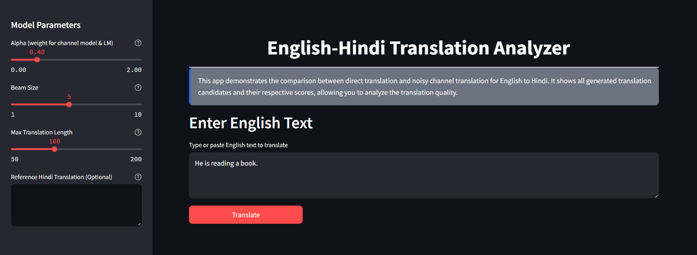
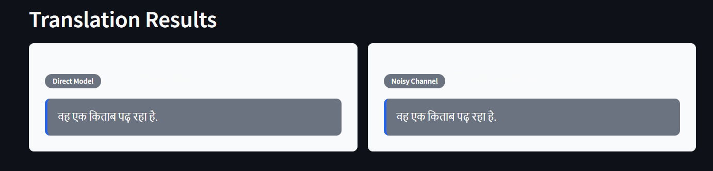
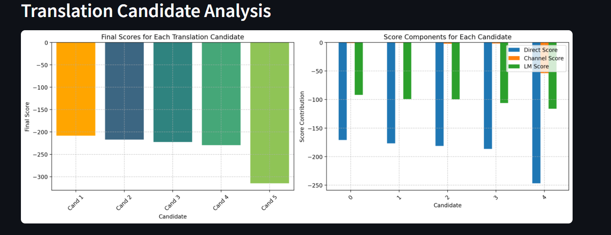
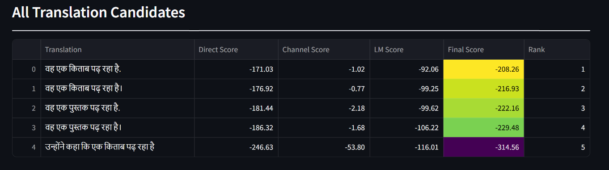
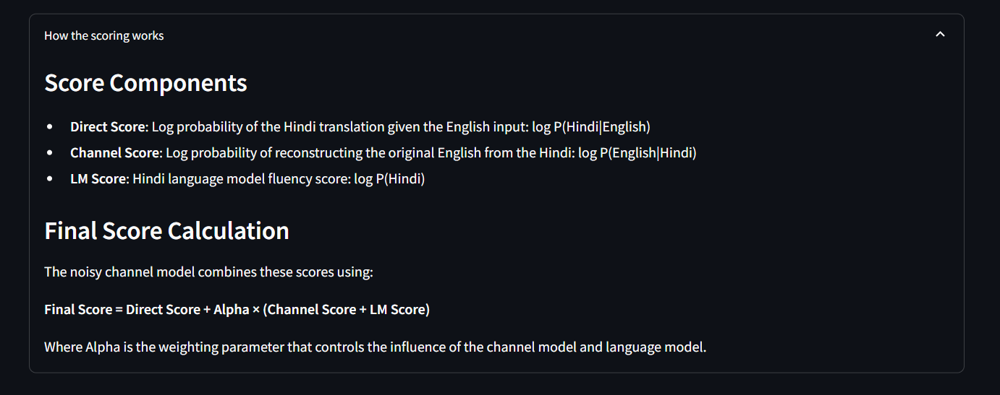
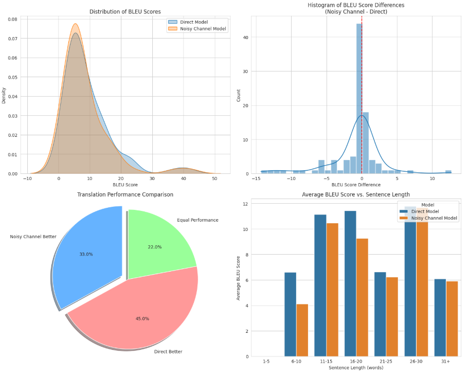
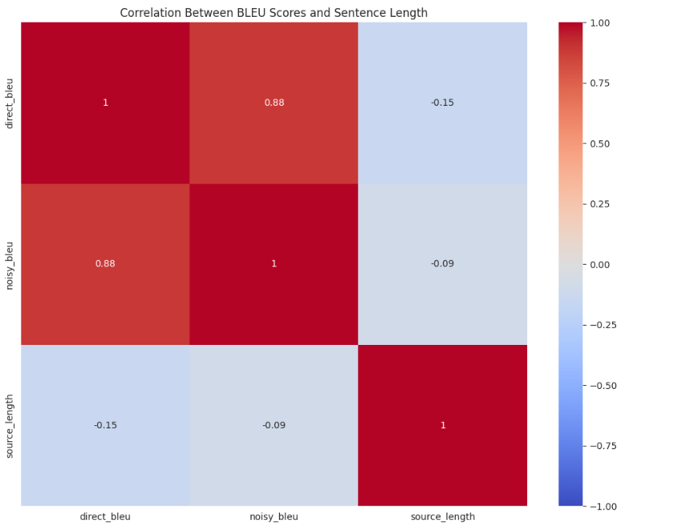
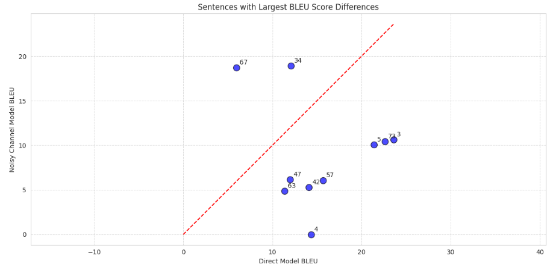

#  Noisy Channel Model for Neural Machine Translation (NMT)


This project presents an implementation of a **Noisy Channel Model** for **Neural Machine Translation (NMT)**

---


## 📷 Demo Images






---

## 📚 Implementation Based on Research Paper

**Title:**  
**Simple and Effective Noisy Channel Modeling for Neural Machine Translation**

**Paper Link:**  
[Facebook Research Paper (PDF)](https://arxiv.org/pdf/1901.11359.pdf)

---

## 🧾 Summary

This project is inspired by the research paper "Simple and Effective Noisy Channel Modeling for Neural Machine Translation" by Facebook AI Research. The paper introduces a framework designed to enhance neural machine translation (NMT) systems, particularly in low-resource scenarios, by leveraging the noisy channel model.

---


## 💡 Key Concepts

- **Noisy Channel Framework:**  
  Reformulates translation as the problem of maximizing the probability of the source sentence given the target, enabling more reliable translations even with limited data.

- **Channel Model:**  
  Predicts the source sentence from a given target sentence.

- **Language Model:**  
  Estimates the fluency and naturalness of the target sentence.

- **Beam Search Decoder:**  
  Integrates scores from the direct model, channel model, and language model to select the most probable translation.

- **BLEU Score**: Used for quantitative evaluation of translation quality.

---

## 🧩 Components & Architecture

#### 🔁 Direct Model (P(y|x))
A sequence-to-sequence Transformer model trained to translate from the source language (English) directly to the target language (Hindi).

#### 🔄 Channel Model (P(x|y))
A reverse sequence-to-sequence Transformer model that reconstructs the original English sentence from a candidate Hindi translation.

#### 📖 Language Model (P(y))
A standalone causal language model trained on a large Hindi corpus to promote fluent and grammatically correct output.

#### 🚀 Beam Search Decoder
An inference-time algorithm that:
- Generates multiple candidate translations using beam search.
- Computes a **combined score**:
  
  \[
  \text{Final Score} = \log P(y|x) + \alpha \times \left( \log P(x|y) + \log P(y) \right)
  \]

- Selects the candidate with the **highest combined score**.

---

### 📦 Project Overview

This project compares two approaches for English-to-Hindi translation:

**Direct Translation Model** – A standard sequence-to-sequence model that directly translates English to Hindi.

**Noisy Channel Model** – An improved method that selects the best translation by combining:
- Direct translation score  
- Reverse translation (channel model) score  
- Language model fluency score

The implementation provides:
- 🖥️ A command-line evaluation framework (via Jupyter Notebook)  
- 🌐 An interactive Streamlit web app for exploring translations and analyzing scores

---

## 🧰 Installation

```bash
git clone https://github.com/SanthoshPrabhu1019/Noisy-Channel-Model-implementation-for-Machine-Translation.git
cd Noisy-Channel-Model-implementation-for-Machine-Translation
pip install -r requirements.txt

```

----
 
## 📋 Requirements

```bash 
streamlit
torch
transformers
sacrebleu
pandas
matplotlib
seaborn
sentencepiece
```
---

## 🔍 Usage

To run the Streamlit web app, use the following command:

```bash
streamlit run app.py
```

This will start an interactive interface where you can:

- Enter English text for translation
- Adjust model parameters such as alpha weight, beam size, and maximum length
- Compare translations generated by both the direct and noisy channel models
- View all candidate translations along with their corresponding scores
- Explore and visualize the components of scores through interactive charts


---

## 📊 Experimental Results

#### OVERALL PERFORMANCE

| Model | Average BLEU Score |
|-------|-------------------|
| Direct Model | 9.03 |
| Noisy Channel Model | 8.14 |
| Average Difference | -0.89 |

#### PERFORMANCE BY SENTENCE LENGTH

| Length | Direct BLEU | Noisy Channel BLEU | Difference |
|--------|------------|-------------------|------------|
| 6-10 words | 6.60 | 4.11 | -2.49 |
| 11-15 words | 11.15 | 10.47 | -0.67 |
| 16-20 words | 11.43 | 9.27 | -2.16 |
| 21-25 words | 6.63 | 6.24 | -0.40 |
| 26-30 words | 11.78 | 11.68 | -0.10 |
| 31+ words | 6.08 | 5.92 | -0.16 |

#### KEY FINDINGS

- Noisy Channel model performs better in 33.0% of sentences
- Direct model performs better in 45.0% of sentences
- Equal performance in 22.0% of sentences
- Direct model performs particularly well across all sentence length categories

---


## 🔍 Justification of BLEU Score Results

#### 1. Use of Different Pretrained Models

In our implementation, the **Direct Model** and the **Channel Model** were built using **separate pretrained architectures**, which were **not jointly optimized** for the noisy channel setting. This is a **simplified implementation** to validate the overall approach.

* The **Direct Model** (source → target) was a pretrained Transformer.
* The **Channel Model** (target → source) and **Language Model** (target-only) were separately trained and **not aligned in terms of vocabulary, tokenization, or domain**.
* Ideally, all components would be **trained or fine-tuned together** with shared vocabularies and consistent pre-processing, as done in the original paper.

📌 *This discrepancy in model compatibility and training objectives likely caused degraded performance of the Noisy Channel pipeline.*

#### 2. Inference Pipeline Limitations

Our current implementation uses a **simplified beam search** strategy without advanced reranking or joint decoding optimization.

* The original paper uses **joint decoding** to balance scores from all three models (Direct, Channel, and LM) dynamically.
* We used **static weighting and separate decoding** steps, which can reduce coherence in final outputs.

⚠️ *This limits the noisy channel's ability to leverage the LM and channel model effectively during inference.*

#### 3. Data and Resource Constraints

The original paper was trained on large-scale parallel corpora. Our implementation used a **smaller dataset**, which disproportionately affects the channel and language models.

* Channel models (target → source) are especially sensitive to data scarcity because they need strong backward mapping.
* Pretrained direct models may still retain strong performance even in low-resource setups.

📉 *This further widens the performance gap in our experiments.*

#### 4. Purpose of Implementation

The goal of this implementation was to **reproduce the high-level idea** behind the noisy channel approach and analyze its impact, not to fully match or exceed the paper's benchmarks.

* Our focus was on **understanding and demonstrating feasibility**, not optimizing for absolute BLEU.
* With proper pretraining, shared tokenizers, consistent training schemes, and decoding improvements, the noisy channel model is expected to outperform in low-resource and morphologically rich settings (as shown in the original research).

#### ✅ Conclusion

While our experimental results show **lower BLEU scores for the noisy channel model**, these are largely due to **simplified and disjoint implementations** of its components. A more rigorous and integrated training approach would likely yield results consistent with the findings of the original research.


---


## 📊 Translation Model Evaluation Visualizations

This section presents visual comparisons between the **Direct Translation Model** and the **Noisy Channel Model** using BLEU scores.


#### 1.  BLEU Score Distribution

Shows the distribution of BLEU scores for both models using kernel density estimates.


#### 2.  BLEU Score Difference Histogram

Displays sentence-level BLEU score differences (`Noisy - Direct`) in a histogram.  
A red dashed line marks equal performance.


#### 3.  Model Performance Overview (Pie Chart)

Shows the proportion of sentences where:
- Noisy Channel performed better
- Direct model performed better
- Both performed equally


#### 4.  BLEU Score vs Sentence Length

Bar chart comparing average BLEU scores across sentence length ranges (e.g., 1–5, 6–10, etc.) for both models.


#### 5.  Correlation Heatmap

Heatmap showing correlation between:
- Direct BLEU
- Noisy BLEU
- Source sentence length


#### 6.  Sentences with Largest BLEU Differences (Scatter Plot)

Scatter plot of the top 10 sentences with the largest BLEU score gap between the models.  
Each point is labeled with its index.







## 🙏 Acknowledgements

- HuggingFace for the pretrained models
- Streamlit for the web application framework
- The NLP community for developing machine translation resources